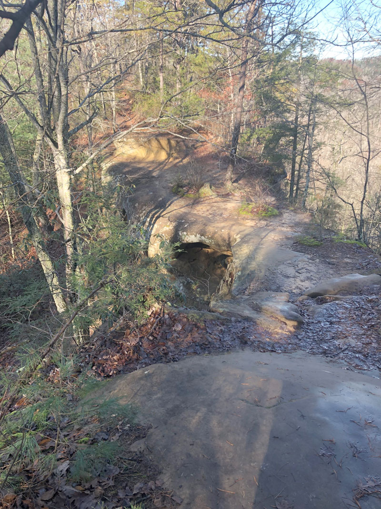
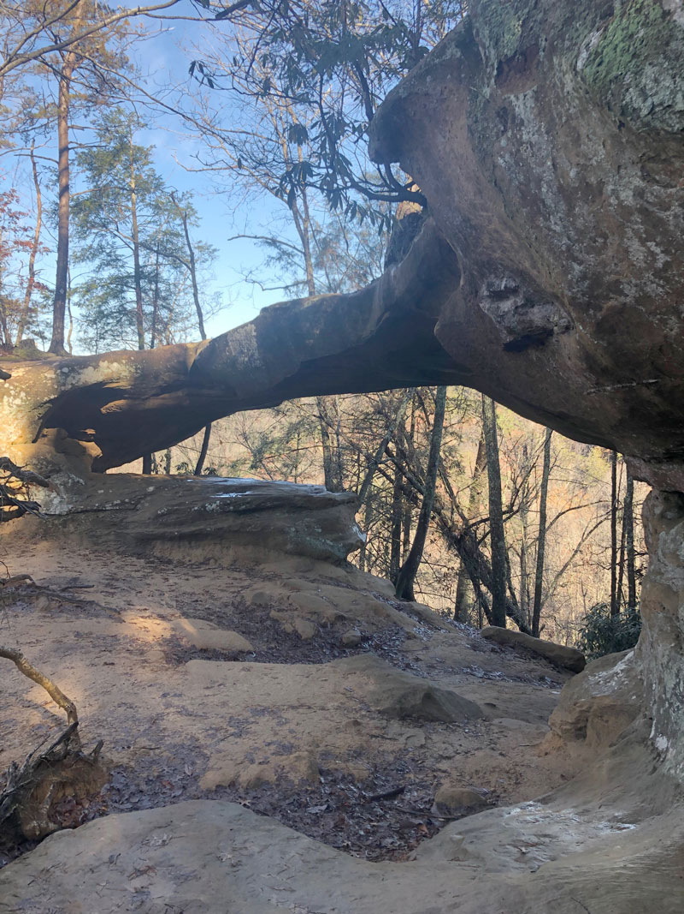
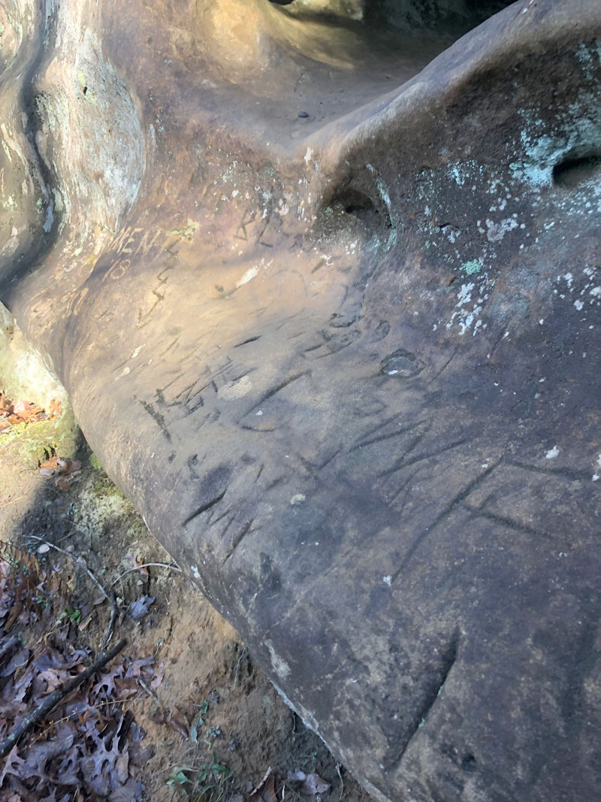
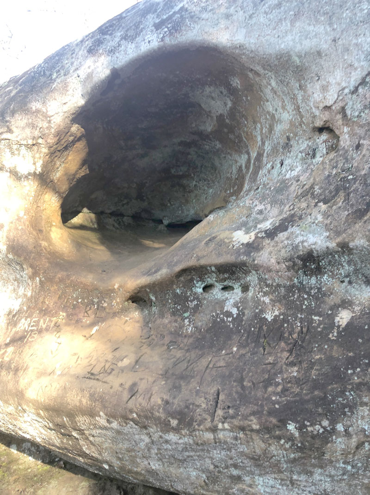

# Field Report
Richard Helsley, Princess Arch, Red River Gorge
Princess Arch is a small arch located within Red River gorge. It is easily accessed by a well marked trail that can be taken by most people. You can actually walk across the arch and will miss it if you just keep walking. There are cliff edges on both sides of the trail the closer you get to the arch so be careful!
Estimated size of the feature is 15 feet high, 4 feet wide. 

