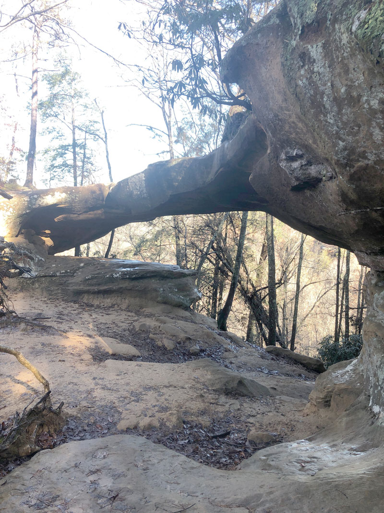
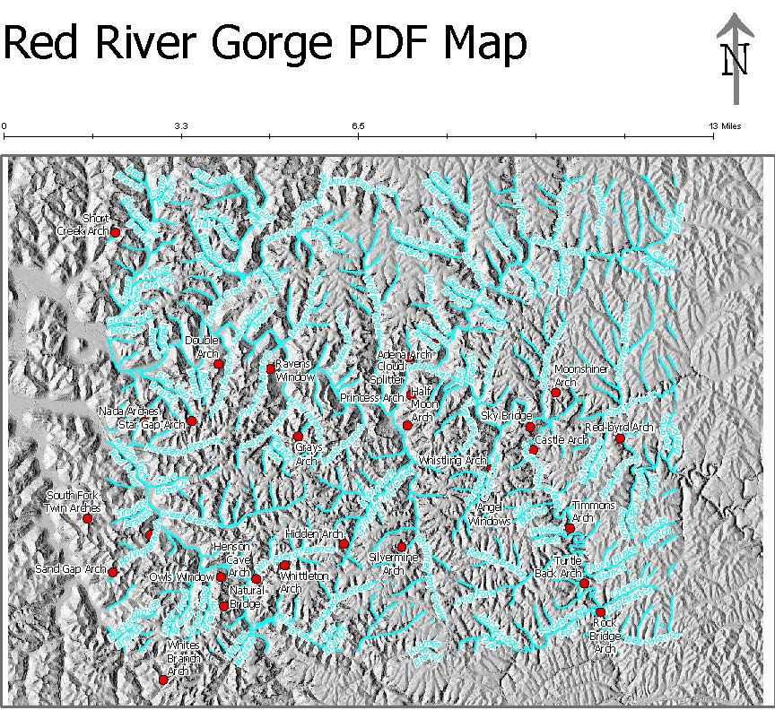

# Red River Gorge
Is one of the best public recreation areas in Kentucky. It's worth the drive!
## [Improvised Map of the Gorge](http://scottdubar.com/illustration/this-months-map-illustration-red-river/)

### Wanders of the Gorge!!!
[Princess Arch]() is one of the smaller arches in the gorge. This doesn't mean however that is doesnt have a large personality or character. It would be a shame to miss out on the beauty and wonder of this little arch that has the benefit of easy access. Less than a mile from the nearest parking area. 

    

Princess Arch

<!DOCTYPE html>
<html>

<head>
  <meta charset=utf-8 />
  <title>Princess Arch</title>
  <meta name='viewport' content='initial-scale=1,maximum-scale=1,user-scalable=no' />
  <!-- Find unique fonts at Google Fonts -->
  <link rel="stylesheet" href="https://cdnjs.cloudflare.com/ajax/libs/normalize/8.0.0/normalize.css" />
  <link href="https://fonts.googleapis.com/css?family=Open+Sans:300,400,700" rel="stylesheet">

  
</head>

<body>
  

  

  <section>
    <!-- Add you information below -->
    <h1>PDF map of Arches in Red River Gorge</h1>

<h2>Authored by: Richard Helsley</h2>

This map was generated using State GIS data for Kentucky. The generation of our own data namely hill shades. There was also the use of the National List of Arches. We used several [Python Codes](https://github.com/HelsleyRE/rrg/blob/master/Lab-04.ipynb) in order to speed up the work process and to get used to working with python. 
    <h3>Map details</h3>
    

    
    

[PDF Map Download](https://github.com/HelsleyRE/rrg/blob/master/Basemap/RRG_Arches.pdf)
    

      University of Kentucky GEO 409, Spring 2018.
    

    

    <ul>
      <li>My <a href="https://user.github.io/bluegrass">Bluegrass maps</a></li>
      <li>Follow me on twitter <a href="https://twitter.com/">@me</a></li>
      <li>Visit <a href='https://github.com'>@mygithubuser</a> </li>
      <li><a href="https://uky-gis.github.io">UKy GIS and Mapping</a></li>
    </ul>
  </section>

</body>
</html>

### Sources
* Richard Helsley
* https://miamistudent.net/the-red-river-gorge-more-than-just-a-climbing-town/