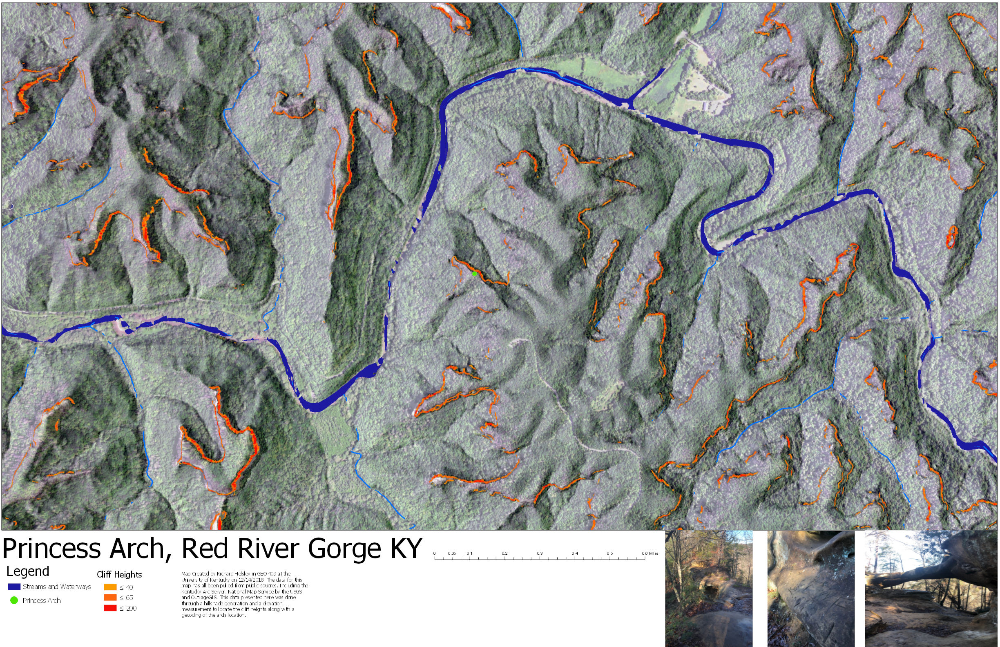

# Red River Gorge
Is one of the best public recreation areas in Kentucky. It's worth the drive!

## [Cartoon Map of the Gorge](http://scottdubar.com/illustration/this-months-map-illustration-red-river/)

### Wanders of the Gorge!!!
[Princess Arch](https://api.mapbox.com/styles/v1/helsleyre/cjp34o3z928ld2rn138vlorx8.html?fresh=true&title=true&access_token=pk.eyJ1IjoiaGVsc2xleXJlIiwiYSI6ImNqcDM0Ym4wdTBlNHQzcnMwdDRmN3FpdWsifQ.4cypf_JwfOAN9YQJnc42Cw#16.2/37.827250/-83.618460/0) is one of the smaller arches in the gorge. This doesn't mean however that is doesnt have a large personality or character. It would be a shame to miss out on the beauty and wonder of this little arch that has the benefit of easy access. Less than a mile from the nearest parking area. The easy trail and great view make this arch well worth the journey.

    
Map of Princess Arch inside of Red River Gorge.

[To Download Click Here](https://raw.githubusercontent.com/HelsleyRE/rrg/master/Princess_Arch.jpg)

    

In person view of Princess Arch!

<!DOCTYPE html>

<body>
  

  

  <section>
    <!-- Add you information below -->
    <h1>PDF map of Arches in Red River Gorge</h1>

<h2>Authored by: Richard Helsley</h2>

This map was generated using State GIS data for Kentucky. The generation of our own data namely hill shades. There was also the use of the National List of Arches. We used several [Python Codes](https://github.com/HelsleyRE/rrg/blob/master/Lab-04.ipynb) in order to speed up the work process and to get used to working with python. 
    <h3>Map details</h3>
    

    
    

[PDF Map Download](https://github.com/HelsleyRE/rrg/blob/master/Basemap/RRG_Arches.pdf)
    

      University of Kentucky GEO 409, Spring 2018.
    

    

    <ul>
      <li>My <a href="https://user.github.io/bluegrass">Bluegrass maps</a></li>
      <li>Follow me on twitter <a href="https://twitter.com/">@me</a></li>
      <li>Visit <a href='https://github.com'>@mygithubuser</a> </li>
      <li><a href="https://uky-gis.github.io">UKy GIS and Mapping</a></li>
    </ul>
  </section>

</body>
</html>

### Sources
* Richard Helsley
* https://miamistudent.net/the-red-river-gorge-more-than-just-a-climbing-town/